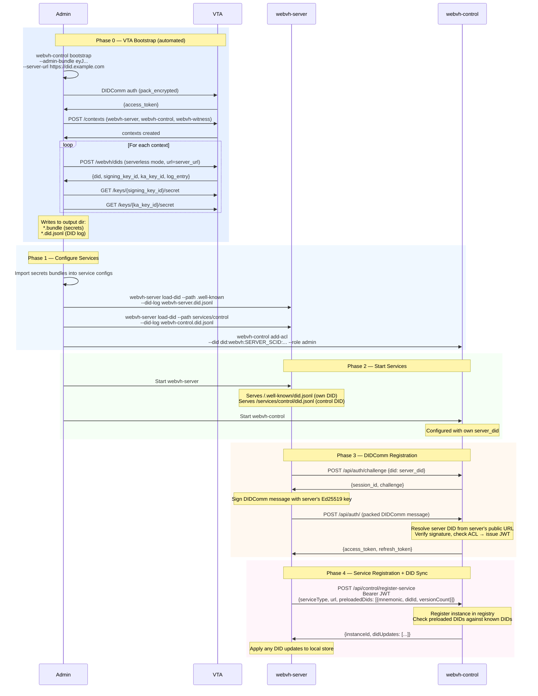

# Bootstrap & Startup Guide

This document explains how to set up a complete WebVH environment with DIDComm-based authentication between services.

## Prerequisites

- A running VTA (Verifiable Trust Agent) with admin credentials
- Compiled WebVH binaries: `webvh-server`, `webvh-control`
- A public URL where the server will serve DIDs (e.g., `https://did.example.com`)

## Architecture Overview

Services authenticate with each other using DIDComm challenge-response:

- **webvh-server** — hosts DID documents at public URLs
- **webvh-control** — manages service registration, ACLs, and DID sync
- **webvh-witness** — provides witness proofs for DID log entries

Each service has its own DID, created during bootstrap. The server authenticates with the control plane using its DID, replacing the previous bearer-token approach.

## Sequence Diagram



## Step-by-Step Setup

### Phase 0: Bootstrap with VTA

Run the bootstrap command to create DIDs for all services:

```bash
webvh-control bootstrap \
  --admin-bundle eyJ... \
  --server-url https://did.example.com \
  --output-dir ./bootstrap-output
```

This creates:
```
bootstrap-output/
  webvh-server.bundle       # secrets bundle (base64url)
  webvh-server.did.jsonl    # DID log entry
  webvh-control.bundle
  webvh-control.did.jsonl
  webvh-witness.bundle
  webvh-witness.did.jsonl
```

### Phase 1: Configure Services

#### 1a. Import secrets

Run the setup wizard for each service and paste the corresponding bundle when prompted:

```bash
webvh-server setup     # paste webvh-server.bundle content
webvh-control setup    # paste webvh-control.bundle content
```

#### 1b. Preload DIDs onto the server

The server needs to host the DID documents for all services:

```bash
# Server's own DID at /.well-known/did.jsonl
webvh-server load-did \
  --path .well-known \
  --did-log bootstrap-output/webvh-server.did.jsonl

# Control plane's DID at /services/control/did.jsonl
webvh-server load-did \
  --path services/control \
  --did-log bootstrap-output/webvh-control.did.jsonl
```

#### 1c. Grant server access to control plane

```bash
webvh-control add-acl --did <server-DID> --role admin
```

Replace `<server-DID>` with the DID printed during the `load-did` step.

#### 1d. Configure control plane URL

Add to the server's `config.toml`:

```toml
control_url = "http://localhost:8532"
```

Or set the environment variable:

```bash
export WEBVH_CONTROL_URL=http://localhost:8532
```

### Phase 2: Start Services

```bash
# Terminal 1
webvh-server

# Terminal 2
webvh-control
```

On startup, the server will:
1. Authenticate with the control plane via DIDComm
2. Register itself, reporting all preloaded DIDs
3. Apply any DID updates received from the control plane

## Daemon Mode (All-in-One)

For development or simple deployments, use `webvh-daemon` which runs all services in a single process:

```toml
# daemon-config.toml
server_did = "did:webvh:..."
public_url = "https://did.example.com"

[server]
host = "0.0.0.0"
port = 8534

[enable]
server = true
control = true
witness = true
watcher = false
```

```bash
webvh-daemon --config daemon-config.toml
```

In daemon mode, inter-service communication happens in-process without network calls.

## Verifying the Setup

### Check server health
```bash
curl http://localhost:8530/api/health
```

### Check DID resolution
```bash
curl http://localhost:8530/.well-known/did.jsonl
curl http://localhost:8530/services/control/did.jsonl
```

### Check control plane registry
```bash
# Requires admin auth token
curl -H "Authorization: Bearer <token>" \
  http://localhost:8532/api/control/registry
```

### Check ACL entries
```bash
webvh-server list-acl
webvh-control list-acl
```

## Environment Variables

### webvh-server
| Variable | Description |
|----------|-------------|
| `WEBVH_SERVER_DID` | Server's DID |
| `WEBVH_PUBLIC_URL` | Public-facing URL |
| `WEBVH_CONTROL_URL` | Control plane URL |
| `WEBVH_CONTROL_DID` | Control plane's DID |

### webvh-control
| Variable | Description |
|----------|-------------|
| `CONTROL_SERVER_DID` | Control plane's DID |
| `CONTROL_PUBLIC_URL` | Public-facing URL |
