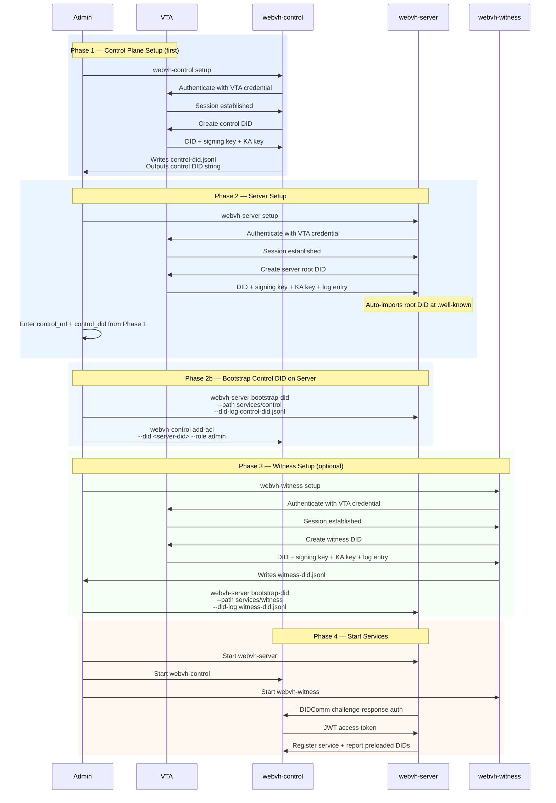

# Bootstrap & Startup Guide

This document explains how to set up a complete WebVH environment with DIDComm-based authentication between services.

## Prerequisites

- VTA (Verifiable Trust Agent) credentials for each service's context
  - Each service gets its own isolated VTA context
  - Credentials are base64url-encoded strings issued by the VTA operator
- Compiled WebVH binaries: `webvh-server`, `webvh-control`, `webvh-witness`
- A public URL where the server will serve DIDs (e.g., `https://did.example.com`)

## Architecture Overview

Services authenticate with each other using DIDComm challenge-response:

- **webvh-control** — manages service registration, ACLs, and DID sync (set up first)
- **webvh-server** — hosts DID documents at public URLs (set up second)
- **webvh-witness** — provides witness proofs for DID log entries (optional, set up last)

Each service connects to its own VTA context during setup, creates its own DID, retrieves keys, and stores them locally. No external PNM CLI is needed.

## Sequence Diagram



## Step-by-Step Setup

### Phase 1: Control Plane (set up first — other services need its DID)

```bash
webvh-control setup
```

The wizard prompts for:
1. **VTA credential** — base64url string for the control plane's VTA context
2. **DID hosting URL** — where webvh-server will serve DIDs (e.g., `https://did.example.com`)
3. **DID path** — path on the server (default: `services/control`)
4. **Public URL** — control plane's own URL for WebAuthn (e.g., `http://localhost:8532`)
5. Host, port, log level, data directory, secrets backend
6. **Admin ACL** — enter an existing DID or generate a new `did:key`

Output:
- `config.toml` — control plane configuration
- `control-did.jsonl` — DID log entry to import on the server
- Control DID string (displayed on screen)

**Save the control DID** — you'll need it when setting up the server.

### Phase 2: Server (set up second — hosts all DIDs)

```bash
webvh-server setup
```

The wizard prompts for:
1. **VTA credential** — base64url string for the server's VTA context
2. **Public URL** — where DIDs are served (e.g., `https://did.example.com`)
3. Features (DIDComm, REST API)
4. **Control plane URL** — e.g., `http://localhost:8532` (from Phase 1)
5. **Control plane DID** — paste the DID from Phase 1
6. Host, port, log level, data directory, secrets backend
7. **Admin ACL** — enter an existing DID or generate a new `did:key`

The wizard automatically creates the root DID and imports it at `.well-known`.

### Phase 2b: Bootstrap Control DID on Server

Import the control plane's DID log entry onto the server:

```bash
webvh-server bootstrap-did \
  --path services/control \
  --did-log control-did.jsonl
```

Grant the server admin access to the control plane:

```bash
webvh-control add-acl --did <server-DID> --role admin
```

Replace `<server-DID>` with the DID printed during server setup.

### Phase 3: Witness (optional — set up after server)

```bash
webvh-witness setup
```

The wizard prompts for:
1. **VTA credential** — base64url string for the witness's VTA context
2. **DID hosting URL** — the server's public URL
3. **DID path** — path on the server (default: `services/witness`)
4. Features, host, port, log level, data directory, secrets backend
5. **Admin ACL**

Import the witness DID on the server:

```bash
webvh-server bootstrap-did \
  --path services/witness \
  --did-log witness-did.jsonl
```

### Phase 4: Start Services

```bash
# Terminal 1
webvh-server --config config.toml

# Terminal 2
webvh-control --config config.toml

# Terminal 3 (if witness is configured)
webvh-witness --config config.toml
```

On startup, the server will:
1. Authenticate with the control plane via DIDComm challenge-response
2. Register itself, reporting all preloaded DIDs
3. Apply any DID updates received from the control plane

## Daemon Mode (All-in-One)

For development or simple deployments, use `webvh-daemon` which runs all services in a single process:

```toml
# daemon-config.toml
server_did = "did:webvh:..."
public_url = "https://did.example.com"
did_hosting_url = "https://did.example.com"

[server]
host = "0.0.0.0"
port = 8534

[enable]
server = true
control = true
witness = true
watcher = false
```

```bash
webvh-daemon --config daemon-config.toml
```

In daemon mode, inter-service communication happens in-process without network calls.

## Verifying the Setup

### Check server health
```bash
curl http://localhost:8530/api/health
```

### Check DID resolution
```bash
curl http://localhost:8530/.well-known/did.jsonl
curl http://localhost:8530/services/control/did.jsonl
```

### Check control plane registry
```bash
# Requires admin auth token
curl -H "Authorization: Bearer <token>" \
  http://localhost:8532/api/control/registry
```

### Check ACL entries
```bash
webvh-server list-acl
webvh-control list-acl
```

## Environment Variables

### webvh-server
| Variable | Description |
|----------|-------------|
| `WEBVH_SERVER_DID` | Server's DID |
| `WEBVH_PUBLIC_URL` | Public-facing URL |
| `WEBVH_CONTROL_URL` | Control plane URL |
| `WEBVH_CONTROL_DID` | Control plane's DID |
| `WEBVH_VTA_URL` | VTA REST URL |
| `WEBVH_VTA_DID` | VTA DID for DIDComm |
| `WEBVH_VTA_CONTEXT_ID` | VTA context ID |

### webvh-control
| Variable | Description |
|----------|-------------|
| `CONTROL_SERVER_DID` | Control plane's DID |
| `CONTROL_PUBLIC_URL` | Public-facing URL |
| `CONTROL_DID_HOSTING_URL` | DID hosting URL (where DIDs are publicly served) |
| `CONTROL_VTA_URL` | VTA REST URL |
| `CONTROL_VTA_DID` | VTA DID for DIDComm |
| `CONTROL_VTA_CONTEXT_ID` | VTA context ID |

### webvh-witness
| Variable | Description |
|----------|-------------|
| `WITNESS_SERVER_DID` | Witness's DID |
| `WITNESS_VTA_URL` | VTA REST URL |
| `WITNESS_VTA_DID` | VTA DID for DIDComm |
| `WITNESS_VTA_CONTEXT_ID` | VTA context ID |
