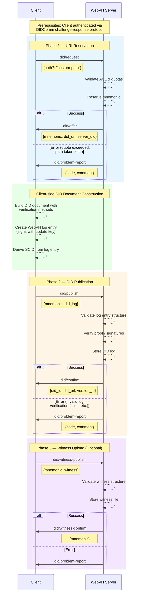
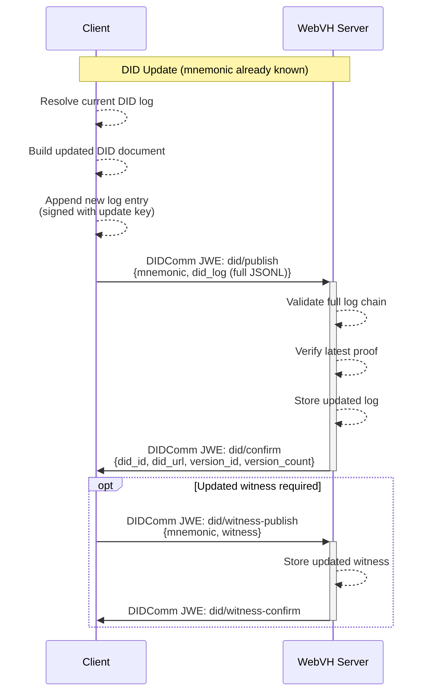
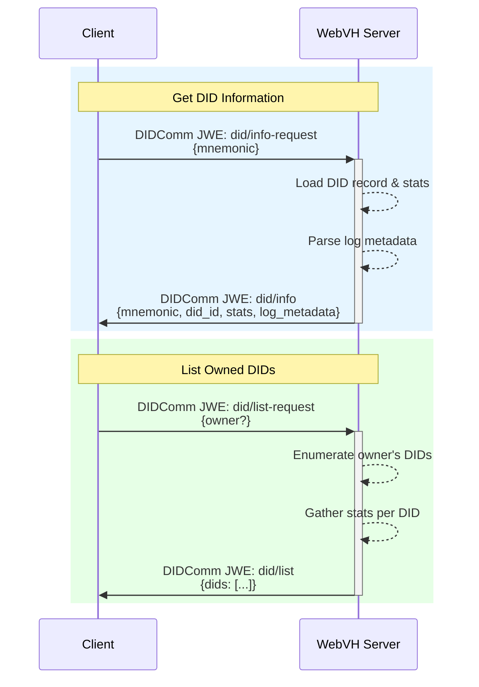
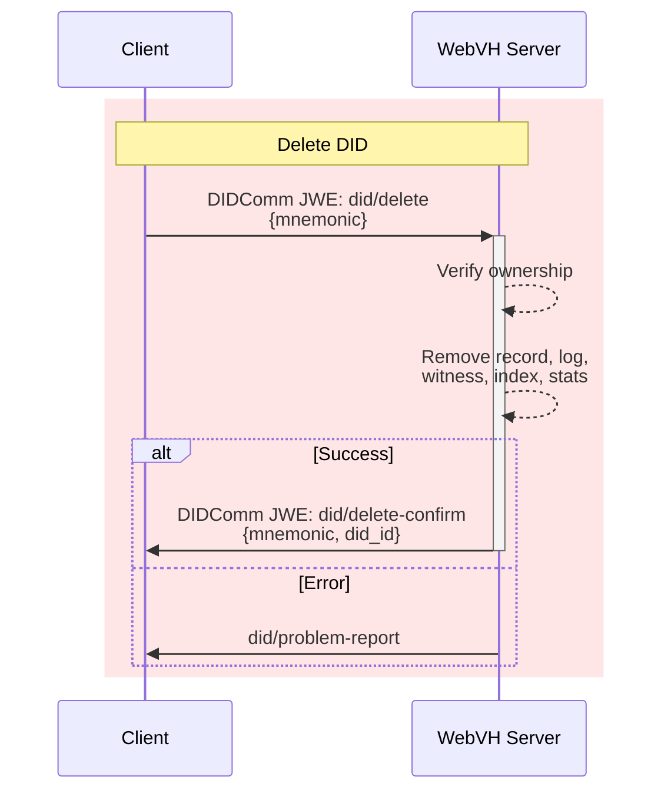
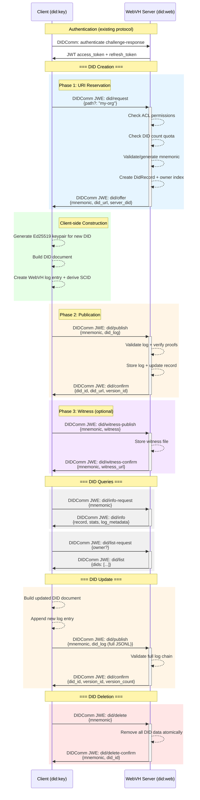

# WebVH DIDComm DID Management Protocol

**Version:** 1.0
**Status:** Draft
**Protocol URI Base:** `https://affinidi.com/webvh/1.0/did`

## Overview

This document specifies a DIDComm v2 protocol for the full lifecycle management of `did:webvh` DIDs through a WebVH service. The protocol replaces the REST-based DID management endpoints with end-to-end DIDComm encrypted messaging, ensuring that all communication between the client and the WebVH server is authenticated, integrity-protected, and confidential.

The protocol covers:
- **Creating** a new DID (URI reservation and initial publication)
- **Updating** a DID (publishing new log entries)
- **Uploading witness** proofs for a DID
- **Querying** DID information and statistics
- **Listing** owned DIDs
- **Deleting** a DID

## Prerequisites

- The client MUST have an authenticated session with the WebVH server, obtained via the existing [authentication protocol](../webvh-server/README.md) (`https://affinidi.com/webvh/1.0/authenticate`).
- The client MUST possess a `did:key` identity with Ed25519 signing and X25519 key agreement keys.
- The server MUST have a resolvable DID with key agreement capabilities for DIDComm encryption.

## Message Types

### DID Creation & Publication

| Message Type | Direction | Description |
|---|---|---|
| `https://affinidi.com/webvh/1.0/did/request` | Client -> Server | Request a new DID URI reservation |
| `https://affinidi.com/webvh/1.0/did/offer` | Server -> Client | Provide the reserved mnemonic and DID URL |
| `https://affinidi.com/webvh/1.0/did/publish` | Client -> Server | Submit the signed DID log entry for publication |
| `https://affinidi.com/webvh/1.0/did/confirm` | Server -> Client | Confirm successful publication |

### Witness Management

| Message Type | Direction | Description |
|---|---|---|
| `https://affinidi.com/webvh/1.0/did/witness-publish` | Client -> Server | Upload a witness proof file for a DID |
| `https://affinidi.com/webvh/1.0/did/witness-confirm` | Server -> Client | Confirm successful witness upload |

### DID Information & Statistics

| Message Type | Direction | Description |
|---|---|---|
| `https://affinidi.com/webvh/1.0/did/info-request` | Client -> Server | Request detailed information about a DID |
| `https://affinidi.com/webvh/1.0/did/info` | Server -> Client | Return DID details, metadata, and statistics |
| `https://affinidi.com/webvh/1.0/did/list-request` | Client -> Server | Request a list of owned DIDs |
| `https://affinidi.com/webvh/1.0/did/list` | Server -> Client | Return the list of DIDs |

### DID Deletion

| Message Type | Direction | Description |
|---|---|---|
| `https://affinidi.com/webvh/1.0/did/delete` | Client -> Server | Request deletion of a DID |
| `https://affinidi.com/webvh/1.0/did/delete-confirm` | Server -> Client | Confirm successful deletion |

### Error Handling

| Message Type | Direction | Description |
|---|---|---|
| `https://affinidi.com/webvh/1.0/did/problem-report` | Either direction | Report an error at any stage |

---

## Protocol Flows

### Create & Publish Flow



### Update Flow



### Info & List Flow



### Delete Flow



---

## Message Specifications

All messages are packed as DIDComm v2 signed/encrypted messages (JWE) using the client's Ed25519 signing key and the server's X25519 key agreement key for encryption.

### 1. DID Request

**Type:** `https://affinidi.com/webvh/1.0/did/request`
**Direction:** Client -> Server

The client initiates DID creation by requesting a URI reservation from the server.

**Message Structure:**

```json
{
  "id": "urn:uuid:550e8400-e29b-41d4-a716-446655440000",
  "type": "https://affinidi.com/webvh/1.0/did/request",
  "from": "did:key:z6MkhaXgBZDvotDkL5257faiztiGiC2QtKLGpbnnEGta2doK",
  "to": ["did:web:webvh.example.com"],
  "created_time": 1700000000,
  "body": {
    "path": "my-custom-name"
  }
}
```

**Body Fields:**

| Field | Type | Required | Description |
|---|---|---|---|
| `path` | string | No | Custom path/mnemonic for the DID. If omitted, the server generates a random mnemonic. Must be URL-safe and not already reserved. |

**Server Processing:**

1. Verify the sender's DID is in the ACL.
2. Check the sender's DID count quota (admins are exempt).
3. If `path` is provided, validate it is URL-safe and available.
4. If `path` is omitted, generate a random mnemonic.
5. Create a `DidRecord` with owner, mnemonic, and timestamps.
6. Store the record and owner index atomically.
7. Respond with `did/offer` or `did/problem-report`.

### 2. DID Offer

**Type:** `https://affinidi.com/webvh/1.0/did/offer`
**Direction:** Server -> Client

The server responds with the reserved mnemonic and the URL where the DID will be resolvable.

**Message Structure:**

```json
{
  "id": "urn:uuid:6ba7b810-9dad-11d1-80b4-00c04fd430c8",
  "type": "https://affinidi.com/webvh/1.0/did/offer",
  "from": "did:web:webvh.example.com",
  "to": ["did:key:z6MkhaXgBZDvotDkL5257faiztiGiC2QtKLGpbnnEGta2doK"],
  "created_time": 1700000001,
  "thid": "urn:uuid:550e8400-e29b-41d4-a716-446655440000",
  "body": {
    "mnemonic": "apple-banana",
    "did_url": "https://webvh.example.com/apple-banana/did.jsonl",
    "server_did": "did:web:webvh.example.com"
  }
}
```

**Body Fields:**

| Field | Type | Required | Description |
|---|---|---|---|
| `mnemonic` | string | Yes | The reserved mnemonic/path for the DID. Used as identifier in subsequent messages. |
| `did_url` | string | Yes | The URL where the DID document will be resolvable after publication. |
| `server_did` | string | Yes | The server's DID, used by the client to construct the DID document with the correct host. |

**Notes:**

- The `thid` (thread ID) MUST reference the `id` of the originating `did/request` message to correlate request and response.
- The client uses `did_url` to derive the host component for DID document construction.

### 3. DID Publish

**Type:** `https://affinidi.com/webvh/1.0/did/publish`
**Direction:** Client -> Server

Used for both initial publication and subsequent updates. The client submits the complete signed WebVH log for the DID.

For initial creation, this follows a `did/request` -> `did/offer` exchange. For updates, the client sends `did/publish` directly using the known mnemonic.

**Message Structure:**

```json
{
  "id": "urn:uuid:7c9e6679-7425-40de-944b-e07fc1f90ae7",
  "type": "https://affinidi.com/webvh/1.0/did/publish",
  "from": "did:key:z6MkhaXgBZDvotDkL5257faiztiGiC2QtKLGpbnnEGta2doK",
  "to": ["did:web:webvh.example.com"],
  "created_time": 1700000010,
  "thid": "urn:uuid:550e8400-e29b-41d4-a716-446655440000",
  "body": {
    "mnemonic": "apple-banana",
    "did_log": "{\"versionId\":\"1-QmHash...\",\"versionTime\":\"2025-01-23T04:12:36Z\",\"parameters\":{\"method\":\"did:webvh:1.0\",\"scid\":\"QmSCID...\",\"updateKeys\":[\"z82Lk...\"],\"portable\":false},\"state\":{\"@context\":[\"https://www.w3.org/ns/did/v1\"],\"id\":\"did:webvh:QmSCID:webvh.example.com:apple-banana\",\"authentication\":[\"did:webvh:QmSCID:webvh.example.com:apple-banana#key-0\"],\"assertionMethod\":[\"did:webvh:QmSCID:webvh.example.com:apple-banana#key-0\"],\"verificationMethod\":[{\"id\":\"did:webvh:QmSCID:webvh.example.com:apple-banana#key-0\",\"type\":\"Multikey\",\"controller\":\"did:webvh:QmSCID:webvh.example.com:apple-banana\",\"publicKeyMultibase\":\"z6Mk...\"}]},\"proof\":[{\"type\":\"DataIntegrityProof\",\"cryptosuite\":\"eddsa-jcs-2022\",\"verificationMethod\":\"did:webvh:QmSCID:webvh.example.com:apple-banana#key-0\",\"proofPurpose\":\"authentication\",\"proofValue\":\"z...\"}]}"
  }
}
```

**Body Fields:**

| Field | Type | Required | Description |
|---|---|---|---|
| `mnemonic` | string | Yes | The mnemonic returned in the `did/offer` message (or previously known for updates). |
| `did_log` | string | Yes | The complete WebVH DID log as a JSONL string. Each line is a signed log entry. For initial creation this is a single line. For updates this contains the full log chain. |

**Server Processing:**

1. Verify the sender owns the DID record associated with the mnemonic.
2. Parse and validate each line of the JSONL log.
3. Verify all Data Integrity Proofs in the log entries.
4. Check total content size against the owner's quota.
5. Extract the `did:webvh` identifier from the last log entry's `state.id`.
6. Store the JSONL content atomically with the updated DID record.
7. Increment version count and update statistics.
8. Respond with `did/confirm` or `did/problem-report`.

### 4. DID Confirm

**Type:** `https://affinidi.com/webvh/1.0/did/confirm`
**Direction:** Server -> Client

The server confirms that the DID log has been successfully stored and the DID is resolvable.

**Message Structure:**

```json
{
  "id": "urn:uuid:8a3b4c5d-6e7f-8901-2345-678901234567",
  "type": "https://affinidi.com/webvh/1.0/did/confirm",
  "from": "did:web:webvh.example.com",
  "to": ["did:key:z6MkhaXgBZDvotDkL5257faiztiGiC2QtKLGpbnnEGta2doK"],
  "created_time": 1700000011,
  "thid": "urn:uuid:550e8400-e29b-41d4-a716-446655440000",
  "body": {
    "did_id": "did:webvh:QmSCID:webvh.example.com:apple-banana",
    "did_url": "https://webvh.example.com/apple-banana/did.jsonl",
    "version_id": "1-QmHash...",
    "version_count": 1
  }
}
```

**Body Fields:**

| Field | Type | Required | Description |
|---|---|---|---|
| `did_id` | string | Yes | The fully resolved `did:webvh` identifier including the SCID. |
| `did_url` | string | Yes | The URL where the DID document can be resolved. |
| `version_id` | string | Yes | The version identifier of the latest published log entry. |
| `version_count` | integer | Yes | Total number of versions for this DID. |

---

### 5. Witness Publish

**Type:** `https://affinidi.com/webvh/1.0/did/witness-publish`
**Direction:** Client -> Server

Uploads a witness proof file for a published DID. The witness file provides third-party attestations of the DID log state and is served alongside the DID log at `/{mnemonic}/did-witness.json`.

**Message Structure:**

```json
{
  "id": "urn:uuid:a1b2c3d4-e5f6-7890-abcd-ef1234567890",
  "type": "https://affinidi.com/webvh/1.0/did/witness-publish",
  "from": "did:key:z6MkhaXgBZDvotDkL5257faiztiGiC2QtKLGpbnnEGta2doK",
  "to": ["did:web:webvh.example.com"],
  "created_time": 1700000020,
  "thid": "urn:uuid:550e8400-e29b-41d4-a716-446655440000",
  "body": {
    "mnemonic": "apple-banana",
    "witness": {
      "proof": [
        {
          "type": "DataIntegrityProof",
          "cryptosuite": "eddsa-jcs-2022",
          "verificationMethod": "did:key:z6MkWitness...#key-0",
          "proofPurpose": "authentication",
          "proofValue": "z..."
        }
      ]
    }
  }
}
```

**Body Fields:**

| Field | Type | Required | Description |
|---|---|---|---|
| `mnemonic` | string | Yes | The mnemonic of the DID to attach the witness to. |
| `witness` | object | Yes | The witness proof JSON object. Contains the witness attestation proofs. |

**Server Processing:**

1. Verify the sender owns the DID record associated with the mnemonic.
2. Verify the DID exists and has a published log.
3. Validate the witness content is not empty.
4. Store the witness file at `content:{mnemonic}:witness`.
5. Respond with `did/witness-confirm` or `did/problem-report`.

### 6. Witness Confirm

**Type:** `https://affinidi.com/webvh/1.0/did/witness-confirm`
**Direction:** Server -> Client

Confirms the witness file has been stored and is publicly accessible.

**Message Structure:**

```json
{
  "id": "urn:uuid:b2c3d4e5-f6a7-8901-bcde-f12345678901",
  "type": "https://affinidi.com/webvh/1.0/did/witness-confirm",
  "from": "did:web:webvh.example.com",
  "to": ["did:key:z6MkhaXgBZDvotDkL5257faiztiGiC2QtKLGpbnnEGta2doK"],
  "created_time": 1700000021,
  "thid": "urn:uuid:550e8400-e29b-41d4-a716-446655440000",
  "body": {
    "mnemonic": "apple-banana",
    "witness_url": "https://webvh.example.com/apple-banana/did-witness.json"
  }
}
```

**Body Fields:**

| Field | Type | Required | Description |
|---|---|---|---|
| `mnemonic` | string | Yes | The mnemonic of the DID the witness was attached to. |
| `witness_url` | string | Yes | The public URL where the witness file can be resolved. |

---

### 7. DID Info Request

**Type:** `https://affinidi.com/webvh/1.0/did/info-request`
**Direction:** Client -> Server

Requests detailed information about a specific DID, including its record metadata, log metadata, and resolution/update statistics.

**Message Structure:**

```json
{
  "id": "urn:uuid:c3d4e5f6-a7b8-9012-cdef-123456789012",
  "type": "https://affinidi.com/webvh/1.0/did/info-request",
  "from": "did:key:z6MkhaXgBZDvotDkL5257faiztiGiC2QtKLGpbnnEGta2doK",
  "to": ["did:web:webvh.example.com"],
  "created_time": 1700000030,
  "body": {
    "mnemonic": "apple-banana"
  }
}
```

**Body Fields:**

| Field | Type | Required | Description |
|---|---|---|---|
| `mnemonic` | string | Yes | The mnemonic of the DID to query. |

**Server Processing:**

1. Verify the sender owns the DID or is an admin.
2. Load the `DidRecord` for the mnemonic.
3. Load resolution/update statistics.
4. If a DID log exists, parse the last entry to extract log metadata.
5. Respond with `did/info` or `did/problem-report`.

### 8. DID Info

**Type:** `https://affinidi.com/webvh/1.0/did/info`
**Direction:** Server -> Client

Returns comprehensive information about a DID, combining the record, log metadata, and statistics.

**Message Structure:**

```json
{
  "id": "urn:uuid:d4e5f6a7-b8c9-0123-def0-234567890123",
  "type": "https://affinidi.com/webvh/1.0/did/info",
  "from": "did:web:webvh.example.com",
  "to": ["did:key:z6MkhaXgBZDvotDkL5257faiztiGiC2QtKLGpbnnEGta2doK"],
  "created_time": 1700000031,
  "thid": "urn:uuid:c3d4e5f6-a7b8-9012-cdef-123456789012",
  "body": {
    "mnemonic": "apple-banana",
    "did_id": "did:webvh:QmSCID:webvh.example.com:apple-banana",
    "did_url": "https://webvh.example.com/apple-banana/did.jsonl",
    "owner": "did:key:z6MkhaXgBZDvotDkL5257faiztiGiC2QtKLGpbnnEGta2doK",
    "created_at": 1700000001,
    "updated_at": 1700000011,
    "version_count": 1,
    "content_size": 1234,
    "stats": {
      "total_resolves": 42,
      "total_updates": 1,
      "last_resolved_at": 1700050000,
      "last_updated_at": 1700000011
    },
    "log_metadata": {
      "log_entry_count": 1,
      "latest_version_id": "1-QmHash...",
      "latest_version_time": "2025-01-23T04:12:36Z",
      "method": "did:webvh:1.0",
      "portable": false,
      "pre_rotation": false,
      "witnesses": true,
      "witness_count": 2,
      "witness_threshold": 1,
      "watchers": true,
      "watcher_count": 1,
      "deactivated": false,
      "ttl": null
    }
  }
}
```

**Body Fields:**

| Field | Type | Required | Description |
|---|---|---|---|
| `mnemonic` | string | Yes | The DID mnemonic. |
| `did_id` | string | No | The `did:webvh` identifier. Null if log not yet published. |
| `did_url` | string | Yes | The public resolution URL. |
| `owner` | string | Yes | The DID of the owner. |
| `created_at` | integer | Yes | Unix timestamp of DID record creation. |
| `updated_at` | integer | Yes | Unix timestamp of last update. |
| `version_count` | integer | Yes | Number of published log versions. |
| `content_size` | integer | Yes | Total stored content size in bytes. |
| `stats` | object | Yes | Resolution and update statistics (see below). |
| `log_metadata` | object | No | Parsed metadata from the DID log. Null if log not yet published. |

**Stats Object:**

| Field | Type | Description |
|---|---|---|
| `total_resolves` | integer | Total number of times the DID has been resolved. |
| `total_updates` | integer | Total number of log updates. |
| `last_resolved_at` | integer or null | Unix timestamp of last resolution. |
| `last_updated_at` | integer or null | Unix timestamp of last update. |

**Log Metadata Object:**

| Field | Type | Description |
|---|---|---|
| `log_entry_count` | integer | Number of entries in the JSONL log. |
| `latest_version_id` | string or null | Version ID of the most recent log entry. |
| `latest_version_time` | string or null | ISO 8601 timestamp of the most recent log entry. |
| `method` | string or null | DID method identifier (e.g., `did:webvh:1.0`). |
| `portable` | boolean | Whether the DID is portable across servers. |
| `pre_rotation` | boolean | Whether pre-rotation (nextKeyHashes) is configured. |
| `witnesses` | boolean | Whether witness configuration is present. |
| `witness_count` | integer | Number of configured witnesses. |
| `witness_threshold` | integer | Required witness threshold. |
| `watchers` | boolean | Whether watcher configuration is present. |
| `watcher_count` | integer | Number of configured watchers. |
| `deactivated` | boolean | Whether the DID has been deactivated. |
| `ttl` | integer or null | Cache TTL in seconds, if configured. |

---

### 9. DID List Request

**Type:** `https://affinidi.com/webvh/1.0/did/list-request`
**Direction:** Client -> Server

Requests a list of DIDs. Regular users receive their own DIDs. Admins may optionally filter by a specific owner.

**Message Structure:**

```json
{
  "id": "urn:uuid:e5f6a7b8-c9d0-1234-ef01-345678901234",
  "type": "https://affinidi.com/webvh/1.0/did/list-request",
  "from": "did:key:z6MkhaXgBZDvotDkL5257faiztiGiC2QtKLGpbnnEGta2doK",
  "to": ["did:web:webvh.example.com"],
  "created_time": 1700000040,
  "body": {
    "owner": "did:key:z6MkSomeOtherUser..."
  }
}
```

**Body Fields:**

| Field | Type | Required | Description |
|---|---|---|---|
| `owner` | string | No | Filter by owner DID. Admin-only — non-admin users always receive their own DIDs regardless of this field. |

**Server Processing:**

1. Determine the target owner:
   - If the sender is an admin and `owner` is provided, list that owner's DIDs.
   - Otherwise, list the sender's own DIDs.
2. Enumerate DIDs via the owner index.
3. For each DID, load the record and statistics.
4. Respond with `did/list`.

### 10. DID List

**Type:** `https://affinidi.com/webvh/1.0/did/list`
**Direction:** Server -> Client

Returns the list of DIDs matching the request criteria.

**Message Structure:**

```json
{
  "id": "urn:uuid:f6a7b8c9-d0e1-2345-f012-456789012345",
  "type": "https://affinidi.com/webvh/1.0/did/list",
  "from": "did:web:webvh.example.com",
  "to": ["did:key:z6MkhaXgBZDvotDkL5257faiztiGiC2QtKLGpbnnEGta2doK"],
  "created_time": 1700000041,
  "thid": "urn:uuid:e5f6a7b8-c9d0-1234-ef01-345678901234",
  "body": {
    "dids": [
      {
        "mnemonic": "apple-banana",
        "did_id": "did:webvh:QmSCID:webvh.example.com:apple-banana",
        "created_at": 1700000001,
        "updated_at": 1700000011,
        "version_count": 1,
        "total_resolves": 42
      },
      {
        "mnemonic": "cherry-date",
        "did_id": "did:webvh:QmSCID2:webvh.example.com:cherry-date",
        "created_at": 1700100000,
        "updated_at": 1700100500,
        "version_count": 3,
        "total_resolves": 7
      }
    ]
  }
}
```

**Body Fields:**

| Field | Type | Required | Description |
|---|---|---|---|
| `dids` | array | Yes | Array of DID summary entries. |

**DID Entry Fields:**

| Field | Type | Description |
|---|---|---|
| `mnemonic` | string | The DID mnemonic/path. |
| `did_id` | string or null | The `did:webvh` identifier. Null if log not yet published. |
| `created_at` | integer | Unix timestamp of DID record creation. |
| `updated_at` | integer | Unix timestamp of last update. |
| `version_count` | integer | Number of published log versions. |
| `total_resolves` | integer | Total resolution count. |

---

### 11. DID Delete

**Type:** `https://affinidi.com/webvh/1.0/did/delete`
**Direction:** Client -> Server

Requests permanent deletion of a DID and all associated data (log, witness, statistics, and owner index). This action is irreversible.

**Message Structure:**

```json
{
  "id": "urn:uuid:01234567-89ab-cdef-0123-456789abcdef",
  "type": "https://affinidi.com/webvh/1.0/did/delete",
  "from": "did:key:z6MkhaXgBZDvotDkL5257faiztiGiC2QtKLGpbnnEGta2doK",
  "to": ["did:web:webvh.example.com"],
  "created_time": 1700000050,
  "body": {
    "mnemonic": "apple-banana"
  }
}
```

**Body Fields:**

| Field | Type | Required | Description |
|---|---|---|---|
| `mnemonic` | string | Yes | The mnemonic of the DID to delete. |

**Server Processing:**

1. Verify the sender owns the DID or is an admin.
2. Load the DID record to obtain the `did_id` and owner.
3. Atomically remove all associated data:
   - DID record (`did:{mnemonic}`)
   - DID log content (`content:{mnemonic}:log`)
   - Witness content (`content:{mnemonic}:witness`)
   - Owner index entry (`owner:{owner}:{mnemonic}`)
   - Statistics (`stats:{mnemonic}`)
4. Respond with `did/delete-confirm` or `did/problem-report`.

### 12. DID Delete Confirm

**Type:** `https://affinidi.com/webvh/1.0/did/delete-confirm`
**Direction:** Server -> Client

Confirms that the DID and all associated data have been permanently removed.

**Message Structure:**

```json
{
  "id": "urn:uuid:12345678-9abc-def0-1234-56789abcdef0",
  "type": "https://affinidi.com/webvh/1.0/did/delete-confirm",
  "from": "did:web:webvh.example.com",
  "to": ["did:key:z6MkhaXgBZDvotDkL5257faiztiGiC2QtKLGpbnnEGta2doK"],
  "created_time": 1700000051,
  "thid": "urn:uuid:01234567-89ab-cdef-0123-456789abcdef",
  "body": {
    "mnemonic": "apple-banana",
    "did_id": "did:webvh:QmSCID:webvh.example.com:apple-banana"
  }
}
```

**Body Fields:**

| Field | Type | Required | Description |
|---|---|---|---|
| `mnemonic` | string | Yes | The mnemonic of the deleted DID. |
| `did_id` | string or null | Yes | The `did:webvh` identifier that was deleted. Null if the log was never published. |

---

### 13. Problem Report

**Type:** `https://affinidi.com/webvh/1.0/did/problem-report`
**Direction:** Either direction

Used to report errors at any stage of the protocol. Follows the [DIDComm v2 Problem Reports](https://identity.foundation/didcomm-messaging/spec/#problem-reports) convention.

**Message Structure:**

```json
{
  "id": "urn:uuid:9f8e7d6c-5b4a-3210-fedc-ba9876543210",
  "type": "https://affinidi.com/webvh/1.0/did/problem-report",
  "from": "did:web:webvh.example.com",
  "to": ["did:key:z6MkhaXgBZDvotDkL5257faiztiGiC2QtKLGpbnnEGta2doK"],
  "created_time": 1700000002,
  "thid": "urn:uuid:550e8400-e29b-41d4-a716-446655440000",
  "body": {
    "code": "e.p.did.quota-exceeded",
    "comment": "DID creation quota exceeded. Current: 10, Maximum: 10."
  }
}
```

**Body Fields:**

| Field | Type | Required | Description |
|---|---|---|---|
| `code` | string | Yes | A machine-readable error code following the DIDComm problem code format. |
| `comment` | string | No | A human-readable description of the error. |

**Error Codes:**

| Code | Applies To | Description |
|---|---|---|
| `e.p.did.unauthorized` | Any | Sender DID is not in the ACL or does not own the resource. |
| `e.p.did.quota-exceeded` | Request | DID creation count quota exceeded. |
| `e.p.did.path-unavailable` | Request | Requested custom path is already taken. |
| `e.p.did.path-invalid` | Request | Requested path contains invalid characters. |
| `e.p.did.mnemonic-not-found` | Publish, Witness, Info, Delete | The mnemonic does not exist. |
| `e.p.did.invalid-log` | Publish | The DID log JSONL is malformed or contains invalid entries. |
| `e.p.did.proof-invalid` | Publish | Data Integrity Proof verification failed. |
| `e.p.did.size-exceeded` | Publish | Content size exceeds the owner's total size quota. |
| `e.p.did.witness-invalid` | Witness Publish | The witness content is empty or malformed. |
| `e.p.did.not-published` | Witness Publish, Info | The DID log has not been published yet. |
| `e.p.did.internal-error` | Any | Unexpected server-side error. |

---

## Full Lifecycle Diagram



---

## Transport

All protocol messages are transported as DIDComm v2 JWE (JSON Web Encryption) messages over HTTPS.

**Endpoint:** `POST /api/didcomm`

The server determines the protocol and message type by unpacking the DIDComm envelope and inspecting the `type` field. A single transport endpoint handles all DIDComm protocols (authentication, DID management, and any future protocols).

**Request:**
- **Content-Type:** `application/didcomm-encrypted+json`
- **Authorization:** `Bearer <access_token>` (required for all DID management messages)
- **Body:** DIDComm v2 JWE packed message

**Response:**
- **Content-Type:** `application/didcomm-encrypted+json`
- **Body:** DIDComm v2 JWE packed response message

## Security Considerations

1. **End-to-End Encryption:** All messages are DIDComm v2 JWE encrypted, providing confidentiality even over TLS-terminated proxies.
2. **Authentication:** The Bearer token ties each message to an authenticated session. The DIDComm `from` field is verified against the session's DID.
3. **Integrity:** Messages are signed with the sender's Ed25519 key before encryption, preventing tampering.
4. **Replay Protection:** Each message has a unique `id` and `created_time`. The server SHOULD reject messages with timestamps outside an acceptable window.
5. **Authorization:** The server verifies ACL permissions and quota limits before processing any DID operation. Ownership checks ensure users can only manage their own DIDs (admins may manage any DID).
6. **SCID Binding:** The Self-Certifying Identifier (SCID) in the `did:webvh` identifier is derived from the initial log entry, cryptographically binding the DID to its creation parameters.
7. **Atomic Deletion:** DID deletion removes all associated data (record, log, witness, index, stats) in a single atomic batch operation, preventing orphaned data.

## Relationship to Existing REST Endpoints

This DIDComm protocol provides equivalent functionality to the following REST endpoints:

| REST Endpoint | Method | DIDComm Equivalent |
|---|---|---|
| `/api/dids` | POST | `did/request` -> `did/offer` |
| `/api/dids/{mnemonic}` | PUT | `did/publish` -> `did/confirm` |
| `/api/witness/{mnemonic}` | PUT | `did/witness-publish` -> `did/witness-confirm` |
| `/api/dids/{mnemonic}` | GET | `did/info-request` -> `did/info` |
| `/api/stats/{mnemonic}` | GET | (combined into `did/info`) |
| `/api/dids` | GET | `did/list-request` -> `did/list` |
| `/api/dids/{mnemonic}` | DELETE | `did/delete` -> `did/delete-confirm` |

The REST endpoints MAY continue to operate alongside the DIDComm protocol for backward compatibility.
